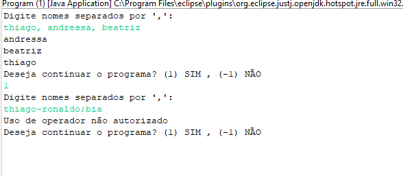

# Tarefa ebac módulo 11-A

Abaixo o print da Saída:

## Resposta Exercício.

[Resposta](https://github.com/ThiagSampaio/tarefas-ebac-Thiago-Sampaio/blob/main/mod9/src/application/Program.java)

Abaixo o print da Saída:

