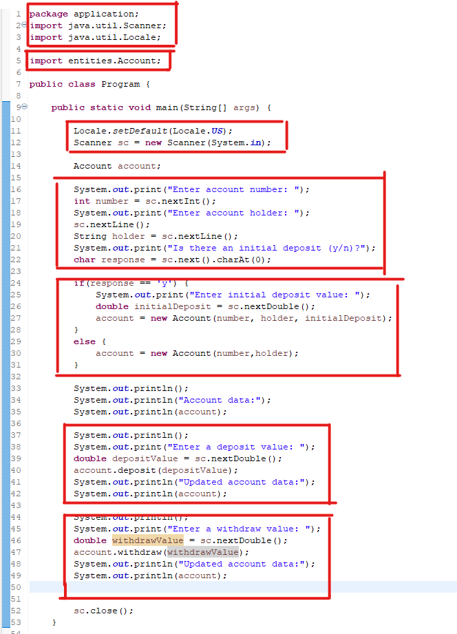

# Criando minha classe em Java - Tarefa ebac módulo 7

## 1- Intordução.

Para realização deste projeto, ao invés de criar uma classe "do nada", resolvi pegar um exercício que trabalha praticamente a mesma coisa, aplicando também alguns conceitos ainda não abordados, porém que fazem total sentido para o contexto do módulo.

Abaixo o leitor pode ler o exercício e logo após, acompanhar a resolução.

<b> 1.1 Exercício </b>

Em um banco, para se cadastrar uma conta bancária, é necessário informar o número da conta, o nome do titular da conta e o valor de depósito inicial que o titular depositou ao abrir a conta. Este valor de depósito inicial, entretanto, é opcional, ou seja: se o titular não tiver dinheiro a depositar no momento de abrir sua conta, o depósito inicial não será feito e o saldo inicial da conta será, naturalmente, zero.

Importante: uma vez que uma conta bancária foi aberta, o número da conta nunca poderá ser alterado. Já o nome do titular pode ser alterado (pois uma pessoa pode mudar o nome por ocasião de casamento, por exemplo).

Por fim, o saldo da conta não pode ser alterado livremente. É preciso haver um mecanismo para proteger isso. O Saldo só aumento por meio de depósitos, e só diminui por meio de saques. Para cada saque realizado, o banco cobra uma taxa de $5.00. Nota: a conta pode ficar com saldo negativo se o saldo não for suficiente para realizar o saque e/ou pagar a taxa.

Você deve fazer um programa que realize o cadastro de uma conta, dando opção para que seja ou não informado o valor de depósito inicial. Em seguida, realizar um depósito e depois um saque, sempre mostrando os dados da conta após cada operação.

<b> 1.1.1 Desenho esperado da classe </b>

<b>1.1.2 Comportamento esperado do programa final</b>

Enter account number: <b>8532</b>

Enter account holder: <b>Alex Green</b>

Is there an initial deposit (y/n)? <b>y</b>

Enter initial deposit value: <b> 500.00 </b>

Account data:

Account 8532, Holder: Alex Green, Balance : $ 500.00

Enter a deposit value: <b>200.00</b>

Updated account data:

Account 8532, Holder: Alex Green, Balance : $ 700.00

Enter a withdraw value: <b>300.00</b>

Updated account data:

Account 8532, Holder: Alex Green, Balance : $ 395.00

## 2- O programa.

<b> 2.1 - Primeiro esboço da classe Account </b>

Na imagem abaixo o primeiro esboço da classe Account

Primeiro, criei a classe com o nome pedido no desenho da classe e depois seus atributos, utilizando o conceito de encapsulamento(complemento logo logo o conceito).

Criei 2 métodos construtores , utilizando o conceito de sobreCarga, obrigando o "usuário" do sistema digitar as infos assim que o objeto é instânciado. 
Como o usuário pode criar uma conta sem saldo, existe o construtor para as três variáveis e também existe o construtor para somente duas variáveis.

Criei depois os métodos get e set dos meus atributos privates("contemplando a finalização do conceito de encapsulamento no qual a regra de ouro diz que os atributos devem ser acessados por meio desses métodos."). Lembrando que o exercício diz que o número da conta é imutável, por isso não existe "setNumber()". O exemplo também diz que o saldo só pode ser mudado via depósito e retirada, por isso não existe "setBalance()".

Este é fim da primeira parte.

<b> 2.2 - Finaliza classe Account </b>

Na imagem abaixo temos a finalização da classe Account

A primeira coisa que percebemos no print que adicionamos 2 métodos, inicialmente pedidos, no desenho da classe. Um método para depósito e outro para retirada(com uma taxa de $5.00)

Outra pequena mudança feita , foi no segundo construtor, no qual ao invés de passar diretamente o valor de balance , chamamos a função deposito. Isso melhora o código, pois se um dia as regras de depósito mudarem, só iremos mudar a função depósito.

Este é fim da segunda parte.

<b> 2.3 - Programa principal - Entry point </b>

Na imagem abaixo temos a finalização do programa principal.

Iniciamos importante os pcts que iremos utilizar, Scanner(para entrada de dados) / Locale(para uso de "."). Importamos também do pacotes entities a classe Account.

Temos dentro da classe a config de Locale e a inicialização do objeto Scanner(para ler a entrada do usuário)

No restante do programa temos o seguir natural do que é pedido como saída pelo exercício. Cada caixa representa um bloco específico do programa. O 2 bloco dentro da classe pega todas as infos sobre a conta e titular . Depois temos um controle de fluxo para vermos se possui depósito inicial ou não. O restante estamos printando os valores, ao final fazendo um depósito e uma retirada. 